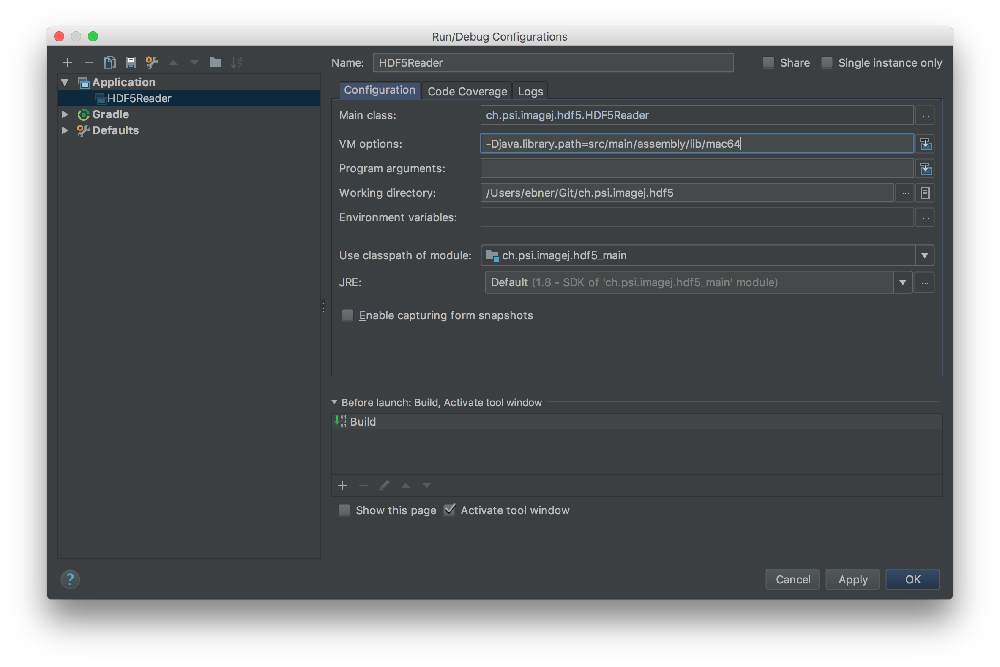

 # Overview

ImageJ plugin for reading and writing HDF5 files.

Upon opening an HDF5 file, an import dialog lists the available image data sets
and allows the selection of one or multiple data sets to be opened:


For 3D datasets, the whole data set is read into an image stack by default.
However, only individual slices can also be selected for visualization.
Furthermore, especially for very big datasets, only every n-th slice can be
selected for visualization. This can be done by either specifying a number,
e.g. `10` (for the slice 10) or a number with a preceding %, e.g. `%10` (for
every 10th image). Indexing starts at 0. Another useful feature when working
with lage data sets is the option to load the data into a virtual image stack.

Note that the Fiji distribution of ImageJ comes with an hdf5 plugin already
installed out of the box. This packaged hdf5 plugin (HDF5_Vibez) has some great
features, and may be all you need. However, it does not allow one to load large
image arrays as virtual stacks, and thus often results in "out of memory"
errors when working with large data sets. In those cases, the PSI plugin for
reading and writing HDF5 files described here might be your preferred choice.


# Usage

To open a HDF5 file use:

```
File > Import > HDF5...
```

To save to an HDF5 file use:

```
File > SaveAs > HDF5
```

## Scripting

To use this plugin from the ImageJs' (python) scripting interface these lines can be used to open a dataset:

```python
from ch.psi.imagej.hdf5 import HDF5Reader
reader = HDF5Reader()
stack = reader.open("",False, "/Users/ebner/Desktop/A8_d_400N030_.h5", "/exchange/data_dark", True)
```

# Installation

## Prerequisites
To be able to install this plugin, ImageJ need to be run with a Java 7 or
greater JVM.

At the time of writing, the latest Fiji distribution of ImageJ comes bundled
with Java 8 by default, while older versions of ImageJ and Fiji are still using
Java 6. ImageJ itself (or more precisely the current ImageJ2 flavor of ImageJ)
seems to still be in a transitionary phase from Java 6 to Java 8 and does not
yet provide the full Java 8 functionality by default. The simplest option is
therefore to use a newer Fiji version which comes bundled with Java 8 for the
installation of this hdf5 plugin.

The one caveat about using Fiji is that one needs to disable the pre-packaged
hdf5 plugin included in the distribution before installing this plugin.

In the following, the installation procedure is detailed for a Fiji
installation with Java 8 included and also for older installations based on
Java 6.

## Checking the Java version

You can check whether Java-8 is included with Fiji as follows:

* Open the update dialog from the menu via Fiji > Help > Update...
* Wait for the application to finish checking for new updates
* In the ImageJ Updater Window, click on "Advanced Mode"
* Type java-8 into the "Search" field.
* If you see an entry lib/Java-8 in the results box below, then Java 8 is ready
  to be used on your system (see screenshots below). 


## Download the source

Download latest HDF5 ImageJ plugin from
[releases](https://github.com/paulscherrerinstitute/ch.psi.imagej.hdf5/releases).


## Installation for Fiji with Java 8


## Installation for older versions of ImageJ/Fiji with Java 6


* Download latest HDF5 ImageJ plugin from [releases](https://github.com/paulscherrerinstitute/ch.psi.imagej.hdf5/releases).

* Go into the ImageJ installation folder and extract the downloaded zip.

```
cd <IMAGEJ_HOME>
unzip <path of downloaded zip>
```

## Configuration (Optional)

If you want to configure the HDF5 Reader as a standard file reader you need to register the reader within the `HandleExtraFileTypes.java` file.
This can be done as follows (details on this can be found on: http://albert.rierol.net/imagej_programming_tutorials.html): 

* Add `HandleExtraFileTypes.java` 

```java
if (name.endsWith(".h5") || name.endsWith(".hdf5")) {
    return tryPlugIn("ch.psi.imagej.hdf5.HDF5Reader", path);
}
```

* Recompile  `HandleExtraFileTypes.java`
```
javac -classpath ij.jar ./plugins/Input-Output/HandleExtraFileTypes.java
```

# Usage

## Mac OS X

```
java -Djava.library.path=./lib/mac64 -Xmx3048m -jar ImageJ64.app/Contents/Resources/Java/ij.jar
```

## Linux

```
java -Djava.library.path=./lib/linux64 -Xmx3048m -jar ij.jar
```

The `Xmx` setting is quite random it depends on how big hdf5 files you are planning to open.


# Fiji
Fiji currently comes with Java 6 bundled. As the HDF5 Plugin requires Java 7 or higher we have to instruct Fiji to use an alternative Java.
This can be done as follows: 

```
cd <FIJI_HOME>
<fiji> --java-home /usr/lib/jvm/jre-1.7.0-openjdk.x86_64 -Djava.library.path=lib/linux64
```

Starting with Java 8 just the LD_LIBRARY_PATH variable need to be set. For MacOSX it is export `DYLD_LIBRARY_PATH=lib/mac64/:$DYLD_LIBRARY_PATH`.

# Development

To be able to run the tests and plugin from within the following arguments need to be passed:



To create an all in one zip file for installation in a ImageJ installation use: 
`mvn clean compile assembly:assembly`

The zip file contains an all in one jar as well as the required native libraries for Windows, Linux and Mac OS X.

Note: to be able to build the package you need to have access to the PSI artifact server. Therefore this only works within the PSI networks and if you have a certain maven configuration. An example Maven settings.xml that you can copy to `~/.m2/settings.xml` is located [here](settings.xml).

# Acknowledgements
This project was inspired by the ImageJ HDF Plugin of Matthias Schlachter Chair of Pattern Recognition and Image Processing, University of Freiburg, Germany ( https://code.google.com/p/imagej-hdf ) . 
It is a complete rewrite of the code with the focus on efficiency and maintainability
