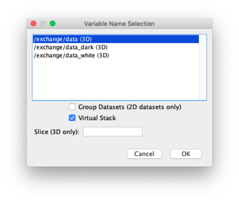
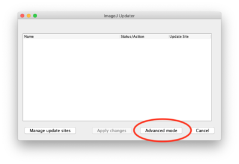
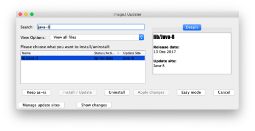
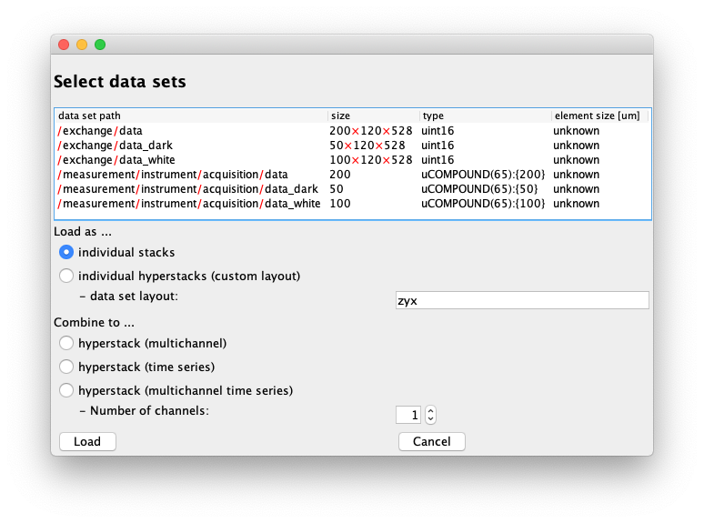

 # Overview

ImageJ plugin for reading and writing HDF5 files.

Upon opening an HDF5 file, an import dialog lists the available image data sets
contained in the file and allows the selection of one or multiple data sets to
be opened:



Note that the Fiji distribution of ImageJ comes with an hdf5 plugin already
installed out of the box. This packaged hdf5 plugin (HDF5_Vibez) has some great
features, and may be all you need. However, it does not allow one to load large
image arrays as virtual stacks or to select only sliced subsets of the data,
and thus often results in "out of memory" errors when working with large data
sets. In those cases, the PSI plugin for reading and writing HDF5 files
described here might be your preferred choice to work with HDF5 files.

# Usage

To open a HDF5 file use:

```
File > Import > HDF5...
```

To save to an HDF5 file use:

```
File > SaveAs > HDF5
```

## Scripting

To use this plugin from the ImageJs' (python) scripting interface these lines
can be used to open a dataset:

```python
from ch.psi.imagej.hdf5 import HDF5Reader
reader = HDF5Reader()
stack = reader.open("",False, "/Users/ebner/Desktop/A8_d_400N030_.h5", "/exchange/data_dark", True)
```

# Installation

All you need is to download the latest HDF5 ImageJ plugin from [releases](https://github.com/paulscherrerinstitute/ch.psi.imagej.hdf5/releases) and copy the jar into the `plugins` directory of ImageJ. After this you should be able to simply start ImageJ and use the Plugin.


# Troubleshooting
### Prerequisites
To be able to run this plugin, ImageJ needs to be run with a Java 8 or
greater JVM.

At the time of writing, the latest Fiji distribution of ImageJ comes bundled
with Java 8 by default, while older versions of ImageJ and Fiji are still using
Java 6. ImageJ itself (or more precisely the current ImageJ2 flavor of ImageJ)
seems to still be in a transitionary phase from Java 6 to Java 8 and does not
yet provide the full Java 8 functionality by default. The simplest option is
therefore to use a newer Fiji version which comes bundled with Java 8 for the
installation of this hdf5 plugin.

The one caveat about using Fiji is that one needs to disable the pre-packaged
hdf5 plugin included in the distribution before installing this plugin.

In the following, the installation procedure is detailed for a Fiji
installation with Java 8 included and also for older installations based on
Java 6.

### Checking the Java version

You can check whether Java-8 is included with Fiji as follows:

* Open the update dialog from the menu via `Fiji > Help > Update...`.
* Wait for the application to finish checking for new updates.
* In the ImageJ Updater Window, click on "Advanced Mode"
* Type `java-8` into the "Search" field.
* If you see an entry `lib/Java-8` in the results box below, then Java 8 is
  ready to be used on your system (see screenshots below).
  




### Installation for Fiji with Java 8

#### Deactivate the distributed hdf5 plugin

As mentioned previously, unfortunately the standard hdf5 plugin (HDF5_Vibez) of
Fiji interferes with the PSI plugin. You will be able to tell which plugin is
currently active when trying to import an hdf5 file
(`Fiji > File > Import > HDF5...`). Once you have selected an hdf5 file, the
standard plugin opens an import dialog that looks as follows: 



To disable the standard hdf5 plugin, follow these steps.

* Open the update dialog from the menu via `Fiji > Help > Update...`.
* Wait for the application to finish checking for new updates.
* In the ImageJ Updater Window, click on "Advanced Mode".
* Type hdf5 into the "Search" field.
* The results box below should now list the `plugins/HDF5_Vibez` entry.
* Select that `plugins/HDF5_Vibez` entry and click "Uninstall" below, then hit
  "Apply Changes".
* The "Status/Action" column of the `plugins/HDF5_Vibez` entry should now say  
  `Not installed`.
* Restart Fiji. 

### Install the PSI hdf5 plugin

The installation of the plugin essentially only requires one to add the downloaded jar into the `plugins`
directory inside the Fiji installation directory. Follow these steps:

* Locate the installation directory of the Fiji application (`FIJI_DIR`).
* Copy the downloaded jar file file into `FIJI_DIR/plugins`
* Close any running instances of the Fiji applications, then reopen Fiji.
* Try to import an hdf5 file: `Fiji > File > Import > HDF5...`.
    * If the installation of the pluging was sucessful, the file import dialog 
      should look like in the screenshot below once you have selected an hdf5 
      file.
    * If there is no `HDF5...` loader available in the
      `Fiji > File > Import` menu, the installation did not succeed. Check that 
      all the files downloaded for the new plugin are actually present in the
      correct locations, i.e. in `<FIJI_DIR>/plugins` and `<FIJI_DIR>/lib`. 
* The new hdf5 plugin is now ready to be used!


## Installation for older versions of ImageJ/Fiji with Java 6

The following steps assume that no other hdf5 plugin is already installed with
ImageJ/Fiji (see above).

Go into the ImageJ installation folder and extract the downloaded zip.

```
cd <IMAGEJ_HOME>
unzip <path of downloaded source zip>
```

The plugin is now available in ImageJ/Fiji, but you may want to configure it 
further for easier use (see below).

### Configuration (Optional)

If you want to configure the HDF5 Reader as a standard file reader you need to
register the reader within the `HandleExtraFileTypes.java` file. This can be
done as follows (details on this can be found on:
http://albert.rierol.net/imagej_programming_tutorials.html): 

* Add `HandleExtraFileTypes.java` 

```java
if (name.endsWith(".h5") || name.endsWith(".hdf5")) {
    return tryPlugIn("ch.psi.imagej.hdf5.HDF5Reader", path);
}
```

* Recompile  `HandleExtraFileTypes.java`
```
javac -classpath ij.jar ./plugins/Input-Output/HandleExtraFileTypes.java
```

### Older Fiji versions
For older versions of Fiji, we have to instruct Fiji to use an alternative Java 
(which has to be installed on the systems separately, of course). This can be 
done as follows: 

```
cd <FIJI_HOME>
<fiji> --java-home /usr/lib/jvm/jre-1.8.0-openjdk.x86_64
```


# Usage

For normal usage, you should just be able to open Fiji/ImageJ as usual and
start using the hdf5 plugin. Below are some hints for advanced usage,
specifying the amount of memory to be used, etc.

```
java -Xmx3048m -jar ij.jar
```

The `Xmx` setting is quite "random" it depends on how big hdf5 files you are
planning to open.


# Development


To create an all in one jar file for installation in a ImageJ installation use:
`./gradlew clean fatJar`

The jar file is an all in one jar including all required native libraries for Windows, Linux and Mac OS X.


## Dependencies
The java HDF5 libary as well as the precompiled code we downloaded and copied from: https://wiki-bsse.ethz.ch/display/JHDF5/Download+Page 
All the necessary jars where copied from there into the `/lib` directory.

The files in the package hdf.objects in this repository were copied from the hdfviewer source code. We were not able to find a jar that contained them.
 

# Acknowledgements
This project was inspired by the ImageJ HDF Plugin of Matthias Schlachter Chair
of Pattern Recognition and Image Processing, University of Freiburg, Germany (
https://code.google.com/p/imagej-hdf ) . It is a complete rewrite of the code
with the focus on efficiency and maintainability
